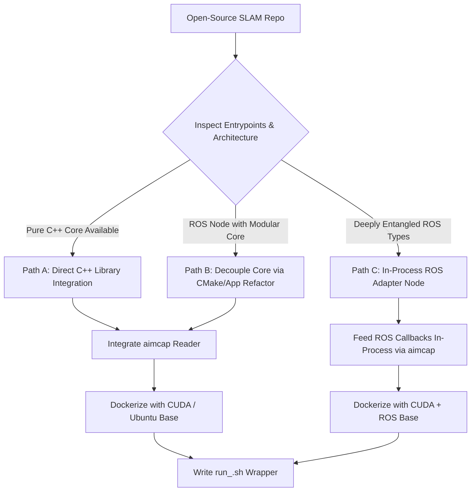

# Standalone SLAM Porting Runbook & Agent Prompt Template

This runbook guides agents in transforming any open-source LiDAR / LiDAR-Inertial SLAM repository into a **standalone, high-throughput MCAP runner** with zero host system pollution, containerized runtime, and standardized TUM trajectory output.

---

## 1. System Architecture & Decision Matrix



### Strategy Selection:
1. **Path A (Preferred — Pure C++ API)**:
   - Identify the core algorithm class (e.g., `LaserMapping`, `Estimator`, `Odometry`).
   - Write a standalone binary `src/<slam>_mcap.cpp` that links directly to the core library.
   - Completely bypass ROS nodes, topics, and message serialization.
2. **Path B (Decoupling Refactor)**:
   - If the core is inside a ROS package but only uses basic types (`Eigen`, `PCL`, `std`), refactor `CMakeLists.txt` to split the algorithm into a non-ROS library target (`<slam>_core`) and link it to the standalone runner.
3. **Path C (In-Process ROS Adapter — Fallback)**:
   - If the codebase cannot easily be untangled from ROS (e.g., custom ROS msg headers throughout core structs):
   - Use a ROS-capable base container.
   - Write a standalone C++ binary that instantiates the ROS node class **in-process** and drives its callback methods directly with `aimcap` decoded data.
   - **Never run external `rosbag play` or ROS master/bridges**; keep execution fully deterministic and in-process.

---

## 2. `aimcap` Integration Guide

### A. CMake Configuration
Add `aimcap` as a submodule in `thirdparty/aimcap` and link it:

```cmake
# thirdparty/aimcap/CMakeLists.txt
option(BUILD_STANDALONE_MCAP "Build standalone MCAP runner" ON)
if(BUILD_STANDALONE_MCAP)
  if(EXISTS "${CMAKE_CURRENT_SOURCE_DIR}/thirdparty/aimcap/CMakeLists.txt")
    set(AIMCAP_BUILD_TESTS OFF CACHE BOOL "" FORCE)
    add_subdirectory(thirdparty/aimcap EXCLUDE_FROM_ALL)

    add_executable(<slam>_mcap src/<slam>_mcap.cpp)
    target_link_libraries(<slam>_mcap
      <slam>_core
      aimcap::reader
    )
    set_target_properties(<slam>_mcap PROPERTIES
      INSTALL_RPATH "$ORIGIN;$ORIGIN/../lib;/usr/local/lib"
      BUILD_WITH_INSTALL_RPATH TRUE
    )
  endif()
endif()
```

### B. Standard `src/<slam>_mcap.cpp` Implementation Skeleton

```cpp
#include <iostream>
#include <fstream>
#include <chrono>
#include <thread>
#include <atomic>
#include <csignal>
#include <aimcap/reader.hpp>
#include <aimcap/types.hpp>

std::atomic<bool> g_shutdown{false};
void sig_handler(int) { g_shutdown.store(true); }

int main(int argc, char** argv) {
  std::signal(SIGINT, sig_handler);
  std::signal(SIGTERM, sig_handler);

  std::string input_mcap = argv[1];
  std::string output_dir = "./results";
  std::string lidar_topic = "/ouster/points";
  std::string imu_topic = "/ouster/imu";

  // 1. Initialize SLAM algorithm instance
  auto slam = std::make_unique<SlamPipeline>();

  // 2. Open TUM trajectory output file
  std::ofstream tum_file(output_dir + "/trajectory_tum.txt");
  tum_file << std::fixed << std::setprecision(6);

  // 3. Initialize aimcap reader
  aimcap::Reader reader(input_mcap, /*add_column_timestamps=*/true);

  // 4. IMU Callback
  reader.OnImu(imu_topic, [&](const std::string&, const aimcap::DecodedImu& imu) {
    if (g_shutdown.load()) { reader.Stop(); return; }
    const double stamp = imu.time_ns * 1e-9;
    slam->insert_imu(stamp,
                     Eigen::Vector3d(imu.linear_acceleration_mps2[0],
                                     imu.linear_acceleration_mps2[1],
                                     imu.linear_acceleration_mps2[2]),
                     Eigen::Vector3d(imu.angular_velocity_radps[0],
                                     imu.angular_velocity_radps[1],
                                     imu.angular_velocity_radps[2]));
  });

  // 5. Point Cloud Callback
  reader.OnPointCloud(lidar_topic, [&](const std::string&, const aimcap::DecodedPointCloud& cloud) {
    if (g_shutdown.load()) { reader.Stop(); return; }
    const double stamp = cloud.stamp_sec + cloud.stamp_nsec * 1e-9;

    // Backpressure flow-control: throttle reading if processing queues are congested
    while (slam->get_queue_depth() > 5 && !g_shutdown.load()) {
      std::this_thread::sleep_for(std::chrono::milliseconds(2));
    }

    // Convert aimcap points to algorithm format (e.g. PCL or Eigen)
    slam->insert_points(stamp, cloud);

    // Write TUM pose [timestamp x y z qx qy qz qw]
    Eigen::Isometry3d pose = slam->get_current_pose();
    Eigen::Quaterniond q(pose.rotation());
    tum_file << stamp << " "
             << pose.translation().x() << " " << pose.translation().y() << " " << pose.translation().z() << " "
             << q.x() << " " << q.y() << " " << q.z() << " " << q.w() << "\n";
  });

  // 6. Run playback loop
  reader.Run();
  tum_file.close();
  return 0;
}
```

---

## 3. Sensor Extrinsics Configuration (LiDAR ↔ IMU)

- **Dataset Convention**: For our datasets and recordings, the **LiDAR ↔ IMU extrinsic transformation is Identity**:
  - Translation: `[0.0, 0.0, 0.0]`
  - Rotation: Identity matrix $I_{3 \times 3}$ (or quaternion $[q_x=0.0, q_y=0.0, q_z=0.0, q_w=1.0]$, or roll/pitch/yaw `[0.0, 0.0, 0.0]`).
- **Configuration Inspection**:
  - Inspect the repository for extrinsic parameters in configuration files (`config/*.yaml`, `*.json`, `*.xml`, ROS parameter files, or C++ header constants).
  - Search keywords: `extrinsic`, `T_lidar_imu`, `extrinsic_T`, `extrinsic_R`, `R_IL`, `t_IL`, `body_T_lidar`.
  - If default/preset extrinsics are hardcoded for benchmark datasets (e.g. Ouster, Velodyne, KITTI, Newer College), **revert/set them to Identity**.
  - Ensure the configuration files mounted into the Docker container default to Identity.

---

## 4. Containerization Standard (Dockerfile)

### Rules:
- **Base image selection**:
  - Non-ROS + CUDA: `nvidia/cuda:12.2.0-devel-ubuntu22.04`
  - ROS2 + CUDA: `nvidia/cuda:12.2.0-devel-ubuntu22.04` with ROS2 Humble base repos added.
  - CPU only: `ubuntu:22.04`.
- **Zero Host Mutation**: Never require libraries installed on the host.
- **Bind mount targets**:
  - `/data` for datasets and result directories.
  - `/opt/<slam>/config` (read-only) for configuration overrides.
- **Naming**: images and containers must follow [Naming Conventions](#naming-conventions-images-and-containers) below.

```dockerfile
FROM nvidia/cuda:12.2.0-devel-ubuntu22.04

ARG GIT_SHA=unknown
LABEL org.opencontainers.image.revision=$GIT_SHA

ENV DEBIAN_FRONTEND=noninteractive
ENV LD_LIBRARY_PATH="/opt/slam/build:/usr/local/lib:${LD_LIBRARY_PATH:-}"

RUN apt-get update && apt-get install -y --no-install-recommends \
    build-essential cmake git pkg-config \
    libboost-all-dev libeigen3-dev libpcl-dev \
    zenity \
    && rm -rf /var/lib/apt/lists/*

WORKDIR /opt/slam
COPY . /opt/slam

WORKDIR /opt/slam/build
RUN cmake .. -DCMAKE_BUILD_TYPE=Release -DBUILD_STANDALONE_MCAP=ON \
    && cmake --build . -j$(nproc) \
    && ln -s /opt/slam/build/<slam>_mcap /usr/local/bin/<slam>_mcap

ENTRYPOINT ["/usr/local/bin/<slam>_mcap"]
CMD ["--help"]
```

---

## 5. Host CLI Runner Template (`run_<slam>.sh`)

The script must provide:
1. Automatic GPU vs CPU detection (`--gpus all`).
2. Dataset folder mapping (`/home/$USER/data` -> `/data`).
3. Seamless host UID/GID mapping (`--user $(id -u):$(id -g)`).
4. GUI / Headless display forwarding with X11 auth.
5. Interactive GUI file-picker fallback via `zenity` when run without arguments.

```bash
#!/usr/bin/env bash
set -e

SCRIPT_DIR="$(cd "$(dirname "${BASH_SOURCE[0]}")" && pwd)"
GIT_SHA="$(git -C "$SCRIPT_DIR" rev-parse --short=7 HEAD)"
git -C "$SCRIPT_DIR" diff --quiet HEAD || GIT_SHA="${GIT_SHA}-dirty"
IMAGE_NAME="<algo>:${IMAGE_TAG:-$GIT_SHA}"   # see Naming Conventions

# 1. GPU Detection
DOCKER_GPU_FLAGS=""
if command -v nvidia-smi &>/dev/null && nvidia-smi &>/dev/null; then
  DOCKER_GPU_FLAGS="--gpus all"
fi

# 2. Dataset & Result Directories
DATA_DIR="${DATA_DIR:-$HOME/data}"
mkdir -p "$DATA_DIR"

# 3. Interactive fallback if no input provided
INPUT_FILE="$1"
if [[ -z "$INPUT_FILE" ]] && command -v zenity &>/dev/null && [[ -n "$DISPLAY" ]]; then
  INPUT_FILE=$(zenity --file-selection --title="Select Input MCAP File" --file-filter="MCAP files (*.mcap) | *.mcap" 2>/dev/null || true)
fi

# 4. Run Docker Container (named + labelled, see Naming Conventions)
DATASET="$(basename "${INPUT_FILE%.*}" | tr -c 'A-Za-z0-9_.\n-' '-')"
RUN_TS="$(date +%Y%m%d-%H%M)"
docker run --rm -it \
  --name "<algo>-${DATASET}-${RUN_TS}" \
  --label slam-eval.tool=<algo> \
  --label slam-eval.dataset="${DATASET}" \
  --label slam-eval.run-id="${RUN_TS}" \
  $DOCKER_GPU_FLAGS \
  --user "$(id -u):$(id -g)" \
  --ipc=host \
  --net=host \
  -e DISPLAY="${DISPLAY:-}" \
  -v /tmp/.X11-unix:/tmp/.X11-unix:ro \
  -v "$DATA_DIR:/data:rw" \
  -v "$SCRIPT_DIR/config:/opt/slam/config:ro" \
  "$IMAGE_NAME" "$@"
```

---

### Naming Conventions (images and containers)

All SLAM tools (`glim`, `hba`, `voxel-slam`, ...) name images and containers the same way, so
tooling can find them and identify which code a run used.

**Images**: `<tool>:<git-sha7>`, for example `glim:a1b2c3d`.
- The tag is the short git SHA of the repo the image was built from. Builds from a dirty tree
  use `<git-sha7>-dirty`. Ground-truth and evaluation runs refuse `-dirty` images.
- `<tool>:dev` may be used as a moving tag for interactive work (viewer, web UI). Never use
  it for ground-truth or evaluation runs.
- Every image carries the label `org.opencontainers.image.revision=<full sha>`, set at build
  time: `docker build --build-arg GIT_SHA=$(git rev-parse HEAD) -t <tool>:<sha7> .`
  Runners verify this label against the repo's HEAD, not the tag, before running.

**Containers**: hyphen-separated, never random or auto-generated names. Dataset names keep their
original case; characters Docker does not allow are replaced with `-`.
- Batch runs: `<tool>-<dataset>-<yyyymmdd-hhmm>`, for example `glim-slam-start-fa2-t3-loop-20260930-0019`.
- Offline viewer: `<tool>-view-<dataset>`.
- Long-lived services: `<tool>-web`.
- Every container gets labels `slam-eval.tool`, `slam-eval.dataset` and `slam-eval.run-id`,
  so `docker ps --filter label=slam-eval.dataset=<dataset>` finds it.
- Wait for a run with `docker wait <name>`, not by filtering on the image name (tags change).

---

## 6. Ready-to-Use Agent Prompt

Copy and paste the prompt below to direct an agent to adapt any open-source SLAM repository:

````markdown
You are tasked with creating a standalone, high-throughput MCAP runner for this repository using `aimcap` and Docker.

Please follow these exact guidelines:
1. **Architecture & Refactoring**:
   - Inspect entrypoints. If a pure C++ library/class API exists, link directly to it and bypass ROS.
   - If the code is ROS-dependent, assess whether to decouple via a clean CMake target or build an in-process adapter that directly drives callbacks without `rosbag play`.
2. **Sensor Extrinsics (LiDAR ↔ IMU)**:
   - For our datasets, the LiDAR ↔ IMU extrinsic transformation is **Identity**.
   - Search the repository for configuration files (`config/*.yaml`, `*.json`, `*.xml`) or parameter code specifying extrinsics (e.g., `extrinsic_T`, `extrinsic_R`, `T_lidar_imu`, `body_T_lidar`) and set them to Identity ($t = [0, 0, 0], R = I$ / $q = [0, 0, 0, 1]$).
3. **`aimcap` Integration**:
   - Add `thirdparty/aimcap` as a submodule / dependency.
   - Implement `<slam>_mcap.cpp` supporting `--input`, `--output`, `--lidar`, `--imu`, `--rate`, `--duration`, `--start`, and `--headless`.
   - Implement flow control/backpressure based on pipeline queue depths to avoid OOM crashes on long datasets.
   - Output trajectories in standard TUM format (`timestamp x y z qx qy qz qw`) to the output folder.
4. **Containerization**:
   - Create a clean `Dockerfile` based on `nvidia/cuda:12.2.0-devel-ubuntu22.04` (or Ubuntu/ROS equivalent if ROS is mandatory).
   - Ensure zero host pollution: all builds and runs happen inside Docker.
   - Follow the Naming Conventions section: SHA-tagged image with the `org.opencontainers.image.revision` label, and named, labelled containers.
5. **Host Launcher (`run_<slam>.sh`)**:
   - Provide automated GPU detection (`--gpus all`), host user mapping (`--user $(id -u):$(id -g)`), dataset mount (`$HOME/data:/data`), and zenity file picker fallback.
6. **Validation**:
   - Build the container image.
   - Verify execution on a sample MCAP recording and confirm that `trajectory_tum.txt` is generated cleanly.
````
